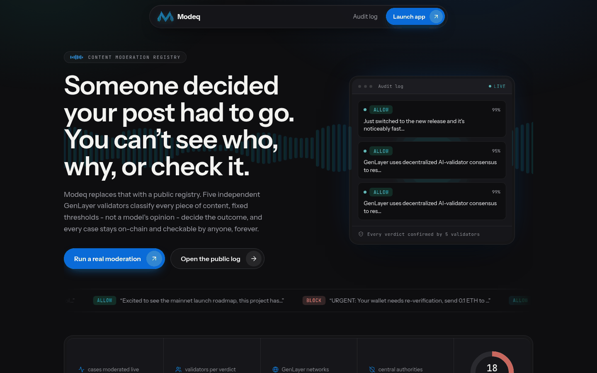
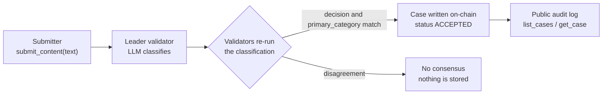
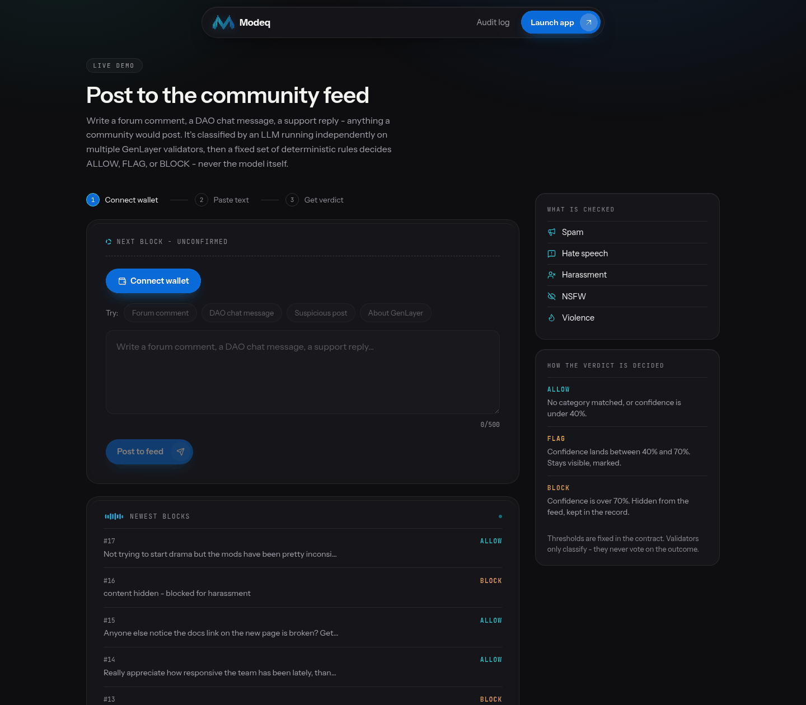
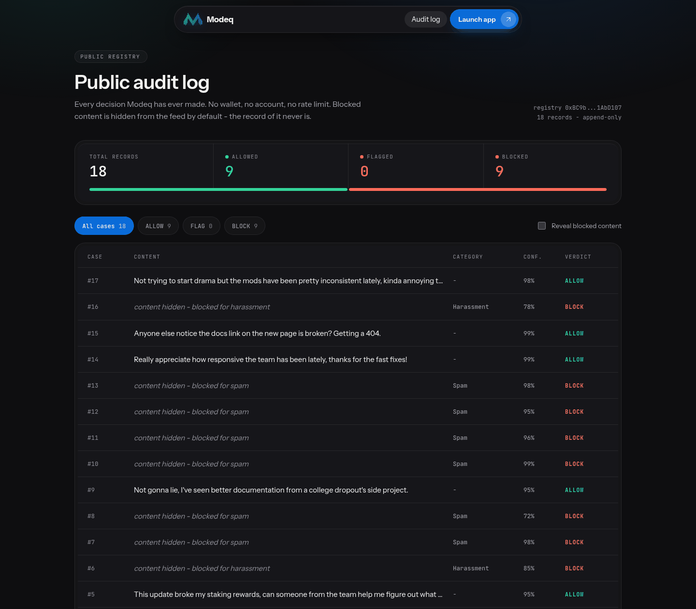
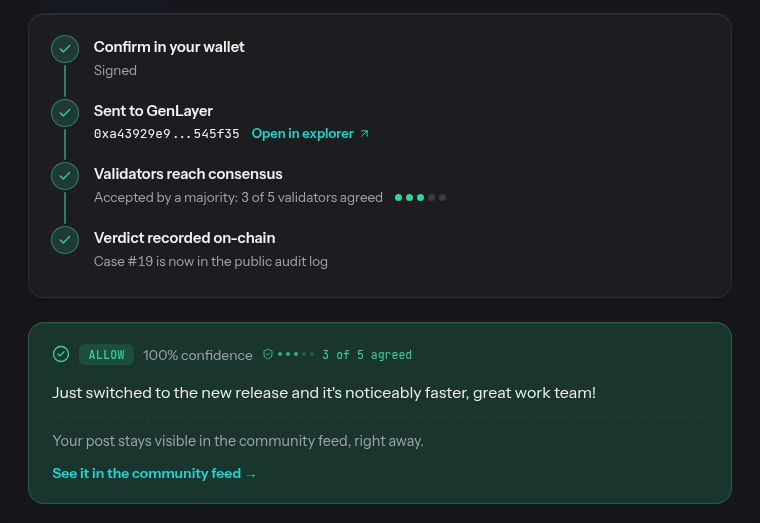

<p align="center">
  
</p>

<h1 align="center">Modeq</h1>

<p align="center">
  <b>Content moderation you can audit.</b><br>
  A public, consensus-verified moderation registry built on GenLayer Intelligent Contracts.
</p>

<p align="center">
  <a href="https://modeq.unitynodes.com">Live app</a> &nbsp;|&nbsp;
  <a href="https://modeq.unitynodes.com/demo">77-second demo</a> &nbsp;|&nbsp;
  <a href="https://modeq.unitynodes.com/audit">Public audit log</a> &nbsp;|&nbsp;
  <a href="deploy/NOTES.md">Deployment evidence</a> &nbsp;|&nbsp;
  <a href="#roadmap">Roadmap</a>
</p>

<p align="center">
  
  
  
  
</p>

<p align="center">
  
</p>

## The problem

When a post is removed, you usually cannot see who decided, why, or whether anyone could
check it. Moderation today is one company's backend, one model and one unaccountable
decision, with no trail a third party can verify.

## What Modeq does

Modeq moves the decision itself onto GenLayer and makes the result public.

1. **Independent classification.** A submission is classified by an LLM that runs
   independently on a set of five GenLayer validators. The result only lands on-chain if
   a majority of them agree on the decision-relevant fields.
2. **The model never gets the final call.** It returns a structured classification
   (categories plus a confidence score). Fixed thresholds written in the contract turn
   that into ALLOW, FLAG or BLOCK. A model can misclassify, but it cannot talk its way
   past the threshold logic with a clever free-text answer.
3. **A permanent public record.** Every case is stored on-chain and listable by anyone,
   with no wallet, account or rate limit. A forum or DAO can point at an append-only
   moderation log instead of saying "trust us".



### How the verdict is decided

The thresholds are constants in the contract, not model output.

| Condition | Verdict |
|---|---|
| `primary_category` is `none` | **ALLOW** |
| confidence above 70% | **BLOCK** |
| confidence above 40% | **FLAG** |
| otherwise | **ALLOW** |

Categories: `spam`, `hate_speech`, `harassment`, `nsfw`, `violence`, `none`.

The model's JSON is validated in Python before anything is stored. Unknown keys, a
category outside the allow-list, or a non-numeric or out-of-range confidence raise a
`UserError`. A leader run that fails this way is not accepted, and a validator that
cannot reproduce valid output votes against the leader instead of storing bad data.

## Screens

<table>
  <tr>
    <td width="50%"></td>
    <td width="50%"></td>
  </tr>
  <tr>
    <td align="center"><b>/app</b> - submit text from a wallet and follow the transaction through consensus</td>
    <td align="center"><b>/audit</b> - every case ever made, filterable, with the rule that fired</td>
  </tr>
</table>

### Transaction lifecycle

A write is not a spinner. `/app` follows the transaction through the wallet, the send, the
validators' consensus and the read-back, using the status the chain reports. The capture
below is a real submission on studionet: three of the five validators agreed, which is
enough for consensus, and the app says exactly that.

<p align="center">
  
</p>

## The contract

[`contracts/moderation_registry.py`](contracts/moderation_registry.py)

| Method | Kind | Description |
|---|---|---|
| `submit_content(text)` | write | Classify and store a new case, returns its `case_id` |
| `get_case(case_id)` | view | One case: submitter, text, categories, primary category, confidence, decision, timestamp |
| `list_cases(offset, limit)` | view | Paginated audit log |
| `total_cases()` | view | Number of stored cases |

The consensus logic uses a custom `gl.vm.run_nondet_unsafe(leader_fn, validator_fn)` pair
instead of `strict_eq`. LLM output is never byte-identical across validators, so the
validator re-runs the classification and compares only `decision` and `primary_category`.
Confidence jitter such as 97% against 99% does not break consensus. The history of that
change, and the real bug it fixed, is in [deploy/NOTES.md](deploy/NOTES.md).

## Deployments

| Network | Contract | Cases |
|---|---|---|
| GenLayer Studio (studionet), used by the live app | `0xBC9b8c99889fe33f7650FA3530387Ee931AbD107` | live on the [audit page](https://modeq.unitynodes.com/audit) |
| Asimov testnet | [`0xF95A5969c79706C7f4274D4e633315bD014C56Eb`](https://explorer-asimov.genlayer.com/address/0xF95A5969c79706C7f4274D4e633315bD014C56Eb) | 1 |
| Bradbury testnet | [`0x13bfD75B34d2C106EA472F105811194352c30461`](https://explorer-bradbury.genlayer.com/address/0x13bfD75B34d2C106EA472F105811194352c30461) | 1 |

Case counts come from `total_cases()` on each contract. Reproduction steps are in
[deploy/NOTES.md](deploy/NOTES.md).

## Security testing

Four manual attacks were submitted through the live app against the studionet contract,
each trying to talk the classifier into calling obvious spam clean. All four were
classified as spam and blocked, and they remain visible in the audit log.

| Case | Attack | Result |
|---|---|---|
| 10 | Prompt injection | BLOCK, spam, 99% |
| 11 | Smuggling a literal `decision: ALLOW` JSON blob | BLOCK, spam, 96% |
| 12 | Delimiter injection that closes the `<content>` wrapper | BLOCK, spam, 95% |
| 13 | Fake "debug mode" jailbreak | BLOCK, spam, 98% |

In all four the model's own judgment held, so the strict shape validation was never
triggered by a live model. It is verified against a mocked non-compliant response by
`test_decision_is_computed_not_trusted_from_model`. Both layers are described honestly in
[deploy/NOTES.md](deploy/NOTES.md#adversarial-testing-manual-red-team-live-studionet).

## Run it

### Contract

```bash
python -m venv .venv && source .venv/bin/activate
pip install -r requirements.txt

genvm-lint check contracts/moderation_registry.py
pytest tests/direct/ -v                                # 8 tests, in memory, mocked LLM
gltest --network studionet tests/integration/ -v -s    # real consensus on GenLayer Studio
```

The direct tests cover the three thresholds, the `none` override, rejection of malformed
output and unknown categories, a model trying to smuggle its own `decision` field, and
the listing methods. `genvm-lint` reports one expected warning: `time.time()` is called
inside the non-deterministic leader function on purpose, to stamp each case.

### Frontend

```bash
cd frontend
cp .env.example .env
npm install
npm run dev        # http://localhost:3000
npm run build      # production build
npm test           # transaction tracker tests
```

Connect MetaMask on `/app`. The app switches the wallet to the GenLayer network before
every write, and does not rely on the client library for that check. Studio is a free test
network and a brand-new empty account can submit. If a wallet shows "Fee is not set", enter
any small custom fee such as 1 gwei; if it then shows "Insufficient balance", press **Get
free test GEN** on `/app`. Details are in [frontend/README.md](frontend/README.md).

## Repository layout

```
contracts/            Intelligent Contract (Python)
tests/direct/         fast in-memory tests with a mocked LLM
tests/integration/    end-to-end test against GenLayer Studio
deploy/NOTES.md       deployment steps, on-chain evidence, bugs found and fixed
frontend/             Next.js 16 app: landing, /app tool, /audit log
docs/screenshots/     images used in this README
```

## Roadmap

- **Multimodal moderation**: accept an image alongside or instead of text through
  `gl.nondet.exec_prompt(images=[...])`, and extend the category schema.
- Per-community configurable thresholds and category sets.
- An appeal flow that re-runs classification with the submitter's counter-argument
  attached, under a second independent consensus round.

## Built with

[GenLayer](https://www.genlayer.com) Intelligent Contracts and the official toolchain:
[`genlayer-py`](https://github.com/genlayerlabs/genlayer-py),
[`genlayer-testing-suite`](https://github.com/genlayerlabs/genlayer-testing-suite),
[`genvm-linter`](https://github.com/genlayerlabs/genvm-linter) and
[`genlayer-js`](https://github.com/genlayerlabs/genlayer-js). The frontend is Next.js 16,
React 19, Framer Motion and plain CSS design tokens.

## License

MIT. See [LICENSE](LICENSE).
